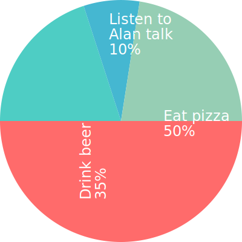
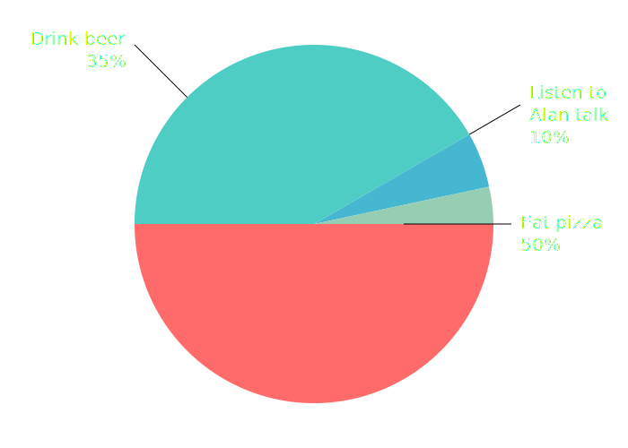

# A Selection Box of AI Tools

Alan Gardner

---

## Everybody is talking about AI... 🙉

<!---->

---

## ... a lot of us are worried about AI 😰

<!---->

---

## AI is just a tool 🤖

---

## Some tools - image generation

There's a ton but I've been using one called NightCafe. As an example, here's a prompt that I gave it...

 

<blockquote class="fragment fade-in" style="font-size: 2rem;">
    A cinematic image of a room full of Python engineers eagerly ripping into a huge pile of chocolate. They're having fun, are wearing their Christmas jumpers, and some are letting off party poppers. In the background, one solitary figure is trying to give a talk that no one is listening to.
</blockquote>

---

)

---

## Some tools - image generation

It's not the most cursed image I've seen... 😬

 

---

## Some tools - song generation

Again, these are popping up like mushrooms these days. Here's one called Udio that I gave the following prompt...

 

> A stoner rock masterpiece about developing python applications using AI coding tools.

 

<a href="https://www.udio.com/songs/37y1x5rdZkY62L4vgLcgGH" target="blank">
    Listen
</a>

---

## Some tools - research and idea generation

<ul>
    <li>
        <a href="https://perplexity.ai" target="blank">Perplexity</a>
    </li>
    <li>
        <a href="https://claude.ai" target="blank">Claude</a>
    </li>
</ul>

---

## Some tools - coding

<ul>
    <li>
        <a href="https://www.cursor.com/" target="blank">Cursor</a>
    </li>
    <li>
        <a href="https://codeium.com/windsurf" target="blank">Windsurf</a>
    </li>
    <li>
        <a href="https://replit.com/~" target="blank">Replit</a>
    </li>
</ul>

---

## Speaking of tools...

---

## Straw poll

Why did we come here tonight?

 

---

## Straw poll

Let's try that again 😅

---

## Do you wanna build ~a snowman ⛄~ something cool with AI? 🤖

<ol>
    <li class="fragment fade-in">Make AI build something cool!</li>
    <li class="fragment fade-in">Break AI and create the most cursed thing you can!</li>
    <li class="fragment fade-in">Tell us why AI should get in the sea.</li>
</ol>

---

## Showcase!

---

## The End

Thanks! 🍫
